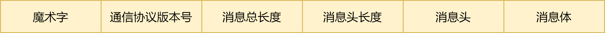

<meta name="referrer" content="no-referrer" />

## 事件驱动的概念


 近年来，随着微服务、云原生和 Serverless 概念的普及以及容器化技术的发展，推出很多关于云服务技术。如servermesh是近年来比较火的技术，其本质在于使用运行时的基础服务代理应用服务的网络请求，使得应用服务只需要关心自身的业务逻辑处理不需要关系服务间网络通信的问题。与servicemesh相对应即是eventmesh，eventmesh主要代理应用服务之间事件驱动以及为其提供相关数据面板，而与服务间消息传递相对应的是事件驱动。
 
 
 
 事件驱动解开与被请求服务的耦合，服务的发起者不需要知道接受者的信息只需要做事件发送。
 
 事件驱动架构是一种用于设计应用的软件架构和模型。对于事件驱动系统而言，事件的捕获、通信、处理和持久保留是解决方案的核心结构。事件驱动架构可以最大程度减少耦合度，很好地扩展与适配不同类型的服务组件。
 
 事件驱动的架构有如下优势:
 - 解耦: 系统间的通信从Request/Response到Pub/Sub将消息的生产角色和消费角色分离
 - 弹性: 事件的生产服务不受消费者的影响，可以持续产生事件，对于高峰事件起到削峰的作用
 - 提供实时事件流: 实时分析非常适合如欺诈检测,预测分析即时解决安全威胁
 - 可追溯和审计:事件可重放可以用于重放错误，以及纠正出错的数据

## Event Mesh
 EventMesh是2020年微众银行在apache开源的组件，是一个动态的云原生事件驱动架构基础设施，EventMesh 之于微服务与Service Mesh 具有同等的定位。EventMesh作为动态的插件式云原生基础服务层，将应用程序和中间件层分离，并提供了灵活，可靠和快速的事件分发能力，同时可以对事件进行管理，可以作为应用进程的连接层，提供企业实现其数字化转型目标所需的全套应用进程间通信模式。

 
 
### 架构

 EventMesh 目前整体的架构如图所示，通过以事件驱动为核心的体系结构,实现了应用程序与中间件层的解耦分离。同时，目前 EventMesh 分别提供了 HTTP API 与 TCP API 更加方便多语言客户端的接入代理。 
  
 
 
 EventMesh-Runtime 组件以插件化的形式运行了不同的 Connector, 进而支持对接多种 Event Store，客户端通过向 Runtime 发出发布\订阅指令，完成事件的发布与订阅。Runtime 基于 Open MessagingConnector Interface 接口，实现对Connector 的调度，客户端所发出的事件交予 Runtime 调度的 Connector，将事件存储到对应的 Event Store 中进而再由订阅对应事件的 EventMesh 将事件接收并转发给所代理的下游客户端

 EventMeshRuntime 大大简化了客户端的逻辑，自身提供了事件的发布\订阅、治理、传输加密、事件路由、Session 管理、负载均衡、指标监控等能力。
 
 关键部件:
 - eventmesh-runtime 一种中间件，用于在事件产生者和使用者之间传输事件，支持云原生应用程序和微服务
 - eventmesh-sdk-java: eventmesh的客户端sdk,目前支持JAVA,网络协议只支持tcp和http
 - eventmesh-connector-api: 一个基于OpenMessaging api和SPI插件机制的接口层，可以有很多不同的事件存储的实现，比如IMDG，Messaging Engine和OSS等
 - eventmesh-connector-rocketmq: 一种基于eventmesh-connector-api的实现，该实现支持将RocketMQ作为事件存储，实现事件的发布与订阅

 
#### Data Panel
  App与 EventMesh 的事件信息交互处于 Data Panel 中，从该模型可以看出EventMesh充分地将事件生产者与消费者进行了解耦，任何事件生产者都不需要知道它们的事件消费者。类似地，当任何事件消费者使用消息时，它们只需要订阅事件流。事件的生产者与消费者均可以弹性地扩缩容而互无影响。

#### Control Panel
 Control Panel 中分为治理模块、注册模块、安全模块、指标模块、追踪定位模块，这些模块都将采用业界通用、优秀的解决方案与 EventMesh进行对接，进而丰富 EventMesh 的生态环境。例如：注册模块可对接 Nacos、指标模块可对接Prometheus、追踪定位模块可对接OpenTracing等。

#### Store Panel
Store Panel 为事件存储面板，借助 connector 插件，客户端通过 EventMesh 可以将事件发布到对应的事件存储中，目前已支持 DeFiBus、RocketMQ 作为事件存储，用户可根据业务的使用场景来选择对应事件存储，进而体验不同事件存储的相关特性。

### 交互细节
 这里主要研究eventmesh的协议结构来了解EventMesh交互细节，当前只有JAVA版本以后可能会实现C++版本和go版本。

 
 
 ```
魔术字：9byte，当前值为“EventMesh”

通信协议版本号：4byte，当前值为“0000”

消息总长度值(length)：4byte，int类型

消息头长度值(headerLength)：4byte，int类型

消息头(header)：长度 = headerLength

消息体(body)：长度 = length - headerLength - 4 - 4
 ```

 协议包的各个CMD
```java
public enum Command {

    //心跳
    HEARTBEAT_REQUEST(0),                              //client发给server的心跳包
    HEARTBEAT_RESPONSE(1),                             //server回复client的心跳包

    //握手
    HELLO_REQUEST(2),                                  //client发给server的握手请求
    HELLO_RESPONSE(3),                                 //server回复client的握手请求

    //断连
    CLIENT_GOODBYE_REQUEST(4),                         //client主动断连时通知server
    CLIENT_GOODBYE_RESPONSE(5),                        //server回复client的主动断连通知
    SERVER_GOODBYE_REQUEST(6),                         //server主动断连时通知client
    SERVER_GOODBYE_RESPONSE(7),                        //client回复server的主动断连通知

    //订阅管理
    SUBSCRIBE_REQUEST(8),                              //client发给server的订阅请求
    SUBSCRIBE_RESPONSE(9),                             //server回复client的订阅请求
    UNSUBSCRIBE_REQUEST(10),                           //client发给server的取消订阅请求
    UNSUBSCRIBE_RESPONSE(11),                          //server回复client的取消订阅请求

    //监听
    LISTEN_REQUEST(12),                            	   //client发给server的启动监听请求
    LISTEN_RESPONSE(13),                               //server回复client的监听请求

    //同步请求
    REQUEST_TO_SERVER(14),                             //client将同步请求发送给server
    REQUEST_TO_CLIENT(15),                             //server将同步请求推送给client
    REQUEST_TO_CLIENT_ACK(16),                         //client收到同步请求后ACK给server
    RESPONSE_TO_SERVER(17),                            //client将同步回包发送给server
    RESPONSE_TO_CLIENT(18),                            //server将同步回包推送给client
    RESPONSE_TO_CLIENT_ACK(19),                        //client收到回包后ACK给server

    //异步事件
    ASYNC_MESSAGE_TO_SERVER(20),                       //client将异步事件发送给server
    ASYNC_MESSAGE_TO_SERVER_ACK(21),                   //server收到异步事件后ACK给client
    ASYNC_MESSAGE_TO_CLIENT(22),                       //server将异步事件推送给client
    ASYNC_MESSAGE_TO_CLIENT_ACK(23),                   //client收到异步事件后ACK给server

    //广播
    BROADCAST_MESSAGE_TO_SERVER(24),                   //client将广播消息发送给server
    BROADCAST_MESSAGE_TO_SERVER_ACK(25),               //server收到广播消息后ACK给client
    BROADCAST_MESSAGE_TO_CLIENT(26),                   //server将广播消息推送给client
    BROADCAST_MESSAGE_TO_CLIENT_ACK(27),               //client收到广播消息后ACK给server

    //重定向指令
    REDIRECT_TO_CLIENT(30),                            //server将重定向指令推动给client
}
```

 可以看出有三种消息类型: 同步消息,异步消息,广播消息
 
 - 同步消息
 
 
 
 - 异步消息
 
 
 
 - 广播消息
 
 

## EventMesh给我们带来什么

 EventMesh本质是一个使用运行时去驱动MQ的架构。最大的特点可以封装不同类型MQ以及Store,提供一系列基础组件热插拔功能，Apache Event Mesh开源了一年多，还不算成熟，其事件驱动架构不算新颖，存在着一下问题:
 
 - 代码侵入性: 对比istio，Event Mesh需要应用程序带有mesh的sdk或实现其相关通信协议
 - 支持面比较小: 目前只支持JAVA语言对于其他语言的支持不够友好
 - 通信时延问题: 客户端到mesh，mesh到store，2段网络传输，忽略mesh runtime的处理时间，这个系统也比直接用中间件，多一倍网络传输时间，并且因为网络丢失消息的风险也增加了一倍 

 
 虽然还是存在一些问题，但 EventMesh的有足够开放性可以增加插件拓展功能

### 可插拔式事件存储
 EventMesh 不仅将事件生产者与消费者进行解耦，还降低了运行时与事件存储代码之间的耦合度。事件存储（DeFiBus/RocketMQ/Kafka/Redis 等）以插件化的形式接入 EventMesh，因此 EventMesh 可以更为灵活地扩展事件存储，通过对接不同的事件存储，用户可以享受到不同事件存储所具有的特性。

### 云原生
 EventMesh 遵循面向云原生的 OpenMessaging 接口定义，通过不同事件存储插件对接口的实现，完成事件的发布\订阅，同时 EventMesh 对事件的定义遵循 Cloud Event 标准协议，统一了不同语言事件接入的协议入口。同时 EventMesh 支持 sideCar 形式的部署模式，可通过K8S进行管理。

### Service Mesh的一种补充
  EventMesh 可以作为 Service Mesh 的补充，在应用程序之间实现更好的通信，并允许应用程序通过将某些功能放在网络层和应用程序层之间使我们可以更多地关注业务逻辑。对于一些特别的事件是可以使用EventMesh

  
 
