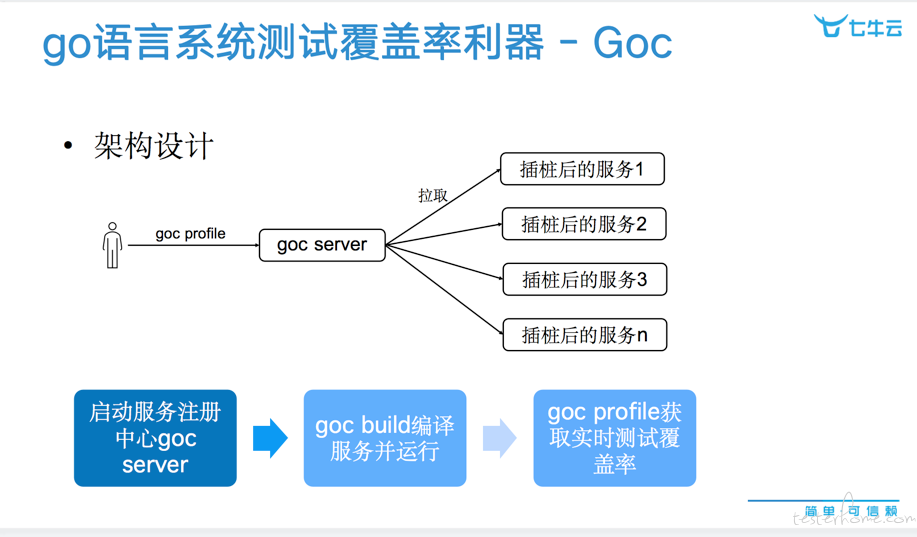
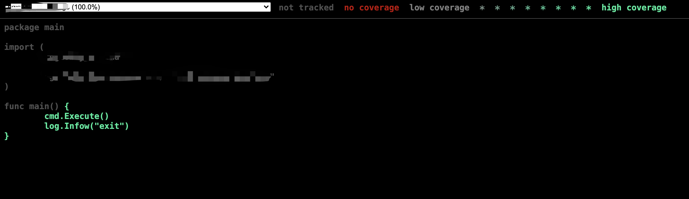

<meta name="referrer" content="no-referrer" />
   对于软件系统健壮性来说，代码测试的覆盖率是很重要一点。在golang中可以使用`go test -c -cover`很好构建出统计覆盖率的二进制文件，在项目CI/CD也一直使用该方法获取单元测试覆盖率，在实际使用中发现不少问题:
   
   - 程序必须关闭才能获取覆盖率，这个问题对于项目中使用还是挺大的，除了单元测试，一些功能测试需要QA配合用手动触发，这样需要关闭程序才能获得覆盖率，不能获得实事覆盖率.
   - `flag`问题，使用`go test -c -cover`需要一个`_test`文件作为程序入口。而`go test`命令必然会调用`flag.Parse`,入口程序的`flag`可能会失败，而且程序启动命令也必须同步修改，在部署过程中会比较麻烦因为涉及和运维帮忙修改。因为`go test`本身就会只带一些flag如`-test.coverprofile, -test.timeout`

  基于这几种考量，需要调研出一个能获取代码运行时覆盖率的方法，同时又不改变对现有部署流程。

## 覆盖率收集原理
 
  golang是通过插桩方式收集覆盖率，在执行`go test -c -cover xx`的时候，会对源码修改，加入一些统计代码后再编译成二进制文件。这样可以获取到运行过那些逻辑单元，除以总行数可以获得覆盖率。通过`go tool cover -mode=count -var=CoverageVariableName xxxx.go`可以看到插桩后的代码。
 
  插桩前代码
```go
package main

import "fmt"
  
func main ()  {
 fmt.Println("hello wrold")
}
  
 ```

 插桩后代码
 ```go
package main

import "fmt"

func main ()  {CoverageVariableName.Count[0]++;
 fmt.Println("hello wrold")
}

var CoverageVariableName = struct {
    Count     [1]uint32
    Pos       [3 * 1]uint32
    NumStmt   [1]uint16
} {
    Pos: [3 * 1]uint32{
        21, 23, 0x2000d, // [0]
    },
    NumStmt: [1]uint16{
        1, // 0
    },
}
```
 可以看到源码多了`CoverageVariableName`变量以及定义，在原逻辑也多了插桩计算的逻辑，`CoverageVariableName`其有三个比较关键的属性:
 
 - `Count` uint32 数组，数组中每个元素代表相应基本块 (basic block) 被执行到的次数
 - `Pos` 代表的各个基本块在源码文件中的位置，三个为一组。比如这里的21代表该基本块的起始行数，23代表结束行数,0x2000d比较有趣，其前 16 位代表结束列数，后 16 位代表起始列数。通过行和列能唯一确定一个点，而通过起始点和结束点，就能精确表达某基本块在源码文件中的物理范围
 - `NumStmt` 代表相应基本块范围内有多少语句 (statement)    
 
 `CoverageVariableName.Count[0]++`统计覆盖率的计算逻辑
 这样可以很方便得到cov文件中相关数据，类似`xxx.go:21.13,23.2 1 1`
 
 我们可以知道只要获得插桩后的代码，增加一个http接口通过`CoverageVariableName`覆盖率计算器，就能获得运行时的cov文件

## 运行时覆盖率利器-goc
 
 goc是七牛云开发团队开源的一个运行时覆盖率的工具,大概原理如上所描述，通过插桩代码收集运行时测试覆盖率数据，通过一个http接口输出。具体运作流程如下:
 
 - 启动center服务,可以通过`goc server`启动,center服务充当插桩服务的服务发现和服务注册的注册中心,用户通过center去调用打桩服务获取覆盖率数据。
 - 通过`goc build`编译插桩服务，编译过程会加入插桩代码,以及一些http接口用于获取覆盖率数据。编译好的插桩服务可以和原来启动方式一样启动，部署的命令不会改变。
 - 启动插桩服务,启动时候会向center服务注册自身信息
 - 通过`goc profile xxx`获取cov文件，在调用`go tool cover`即可获得覆盖率以及跑过的代码数据。
 
 goc的服务架构:
 
 
 具体安装方式参照goc源码地址:[https://github.com/qiniu/goc](https://github.com/qiniu/goc)
 
 goc编译时候和go build比较相似可以很轻松使用goc编译服务，而且不会影响服务的`flag`，可以使用原来的启动命令启动.

## goc的问题以及解决方法

 goc虽然很好用，但在项目实际应用可能缺少一些功能以及存在一些问题
 
 - 获得的覆盖率文件不够直观，原始的cov文件只有原始覆盖率信息，需要通过`go tool cover`计算覆盖率以及跑过的代码。实际应用中，测试同学关注是代码覆盖率，而开发同学更关注代码运行过的源代码。需要直接获取到一个`go tool cover`计算后的数据或代码文件.
 - 插桩服务的名称，插桩服务运行时候会向sever注册自身信息，注册的服务名是二进制文件的名称，而实际部署中多个微服务的二进制文件名是一样的，需要一个服务名选项加以区分。
 - go mod vendor模式的编译问题。因为goc编译时候会新建一个临时目录将代码复制被打桩。如果`go.mod`使用了`replace`相对路径方式，会因为移动目录导致编译失败,所以goc在编译时会修改`go.mod`文件将相对路径改成绝对路径。但如果使用`mod=vendor`的buildflag会因为`vendor`文件不一致导致编译失败。
 - center中服务信息失效, 打桩服务启动和推出时候会注册和注销操作，但若服务panic或没正常退出。导致center服务中注册的服务信息是失效的。`goc profile`会失败,因为某个服务已经失效(可以增加 --skip 参数解决)。

 基于上面多个问题和结合项目应用，在goc源码中修改并处理这些问题
 
 - 获得跑过的代码，这个最为困难,因为`go tool cover --htmlout`需要服务源代码,而center服务是没有打桩服务的源码，生成html的操作只能由打桩服务实现。编译获取打桩服务的源码,通过`embed`方式注入到打桩服务程序中,通过`golang.org/x/tools/cover`包知道生成html文件相关代码
 
  
  
  这样一来就能实时获取运行时覆盖率，以及跑过的代码。这么一看显得有点像"动态语言"感觉，在项目中goc编译后的服务部署在测试环境中，帮助修复了不少bug,因为可以很直观看到跑过哪一部分代码。
  
  - 插桩服务名称，这个处理较为简单只需要`goc build`命令行参数增加`service`代表插桩服务名称. 相关pr:[https://github.com/qiniu/goc/pull/199](https://github.com/qiniu/goc/pull/199) 但此pr并没有得到 goc merge
  - vendor解决,编译时候检查`buildflags`是否为vendor模式,vendor模式编译不修改`go.mod`文件。相关pr: [https://github.com/qiniu/goc/pull/237](https://github.com/qiniu/goc/pull/237) 此pr已经得到合并
  - center中服务信息失效问题,可以增加一个keepalive机制。打桩服务需要定时向center发送keepalive信息,center服务定时清理过期服务信息。
  
  基于`goc`的`7da52236182f82e0c8a5279d19071a9661309963`版本修改，fork一个goc的仓库（仓库地址: [https://github.com/socket515/goc/tree/feature/cover_report](https://github.com/socket515/goc/tree/feature/cover_report) ）,此外还为goc增加一些新功能，如覆盖率变化曲线,覆盖率变化图表等。更详细欢迎去仓库中看，提出issue。